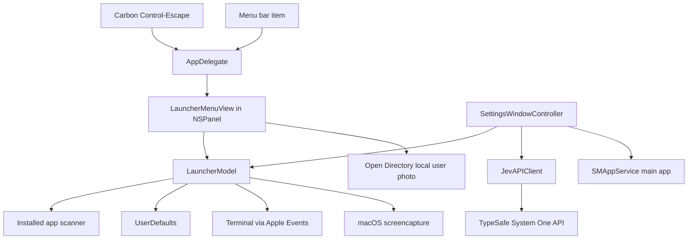

# Architecture

## Overview

The app uses a manually managed `NSApplication` lifecycle rather than a SwiftUI `WindowGroup`. This keeps launch behavior menu-bar-only and lets the launcher panel and settings window be created independently.

## App startup and launcher

1. `CtrlEscApp.main()` sets the activation policy to `.accessory` and starts `NSApplication`.
2. `AppDelegate` creates the status item, launcher panel, settings controller, and Carbon global hotkey monitor.
3. Control-Escape or the status item calls `MenuPanelController.toggle()`.
4. The key-capable floating panel hosts `LauncherMenuView`. Showing it focuses search and positions it near the pointer’s screen. Escape dismisses it; deactivation hides it.

Relevant files:

- `Sources/CtrlEsc/main.swift` — process lifecycle and menu-bar wiring
- `Sources/CtrlEsc/GlobalHotKeyMonitor.swift` — Carbon hotkey registration
- `Sources/CtrlEsc/MenuPanelController.swift` — launcher panel behavior
- `Sources/CtrlEsc/LauncherMenuView.swift` — launcher UI
- `Sources/CtrlEsc/SettingsWindowController.swift` — lazy settings window
- `Sources/CtrlEsc/MacOSAccountPhoto.swift` — current local account photo, with a generic-avatar fallback

## Login startup and account photo

The Settings window registers or unregisters `SMAppService.mainApp` for Launch at Login. macOS owns the Login Items state; if user approval is required, Settings can open the Login Items pane in System Settings.

The shortcut panel looks up the current local user record through Open Directory. It uses the `JPEGPhoto` data or the `Picture` file path when available, and shows the generic person symbol otherwise. The account name remains the short name returned by `NSUserName()`.

## Application model

`LauncherModel` is the shared `@Observable` source for the launcher and settings UI. It scans `/Applications`, `/System/Applications`, and `~/Applications`, reads bundle metadata, and assigns apps to the launcher’s application groups. The installed bundle path is the app identity because different app bundles can share a bundle identifier. Bundle identifiers remain available as metadata and as a legacy key for migrating saved preferences.

The categories `Pinned`, `Frequent`, `All Applications`, and `CLI` are launcher views, not AI classification destinations. `applicationGroupCategories` excludes those views and provides the real app groups such as Education, Games, Development, and Other.

## Local persistence

The app uses `UserDefaults.standard` for preferences:

| Key | Contents |
| --- | --- |
| `pinnedAppIDs` | Paths of pinned app bundles |
| `recentAppIDs` | Paths of recently opened app bundles |
| `appSearchAliases` | Installed app bundle path to alternate search terms |
| `cliApps` | JSON-encoded CLI executable paths |
| `appCategoryOverrides` | App path to AI-assigned application group |

The Jev API key is held in the Settings view’s in-memory state only. It is not stored in UserDefaults, a file, or the app bundle.

## Search aliases and CLI apps

Aliases are trimmed, deduplicated case-insensitively, and matched against app names during search. They are associated with the installed bundle path, which keeps apps with duplicate bundle identifiers independent.

CLI entries are user-supplied absolute executable paths. A selected command runs in Terminal so interactive terminal programs receive a TTY. The app uses Apple Events to ask Terminal to execute the shell-quoted path. CLI entries remain in their dedicated launcher group and are not part of Jev’s macOS application classification list.

## Capture action

The exact search terms `capture`, `screen capture`, `capture screen`, `screenshot`, and `screenshot to clipboard` show a built-in action. Selecting it runs `/usr/sbin/screencapture -i -c`, which opens the macOS region selector and copies the capture to the clipboard.

## Jev app-group sorting

`JevAPIClient` talks directly to TypeSafe’s documented HTTP API:

- `GET https://api.typesafe.ai/v1/models` verifies the supplied key and discovers a model name.
- `POST https://api.typesafe.ai/v1/systemone` sends the classification decision.
- Both requests use `Authorization: Bearer <key>`.

The sort request contains the full scanned app catalog (display name, bundle identifier, and stable catalog index) and the full set of application-group names in `state`. It includes one `choice` question per app, with the group names and descriptions as the choice criteria. The app accepts only returned choices that match its available group names. Once the response is complete, assignments are saved in `appCategoryOverrides` and applied to the in-memory app list.

This is an external data transfer: app names, bundle identifiers, and group names are sent to TypeSafe when the user starts sorting. App paths and CLI entries are not included. The client does not call TypeSafe until the user verifies a key or starts sorting. TypeSafe’s official API reference is [api.typesafe.ai/redoc](https://api.typesafe.ai/redoc).

## Bundle metadata

`Scripts/build-app.sh` assembles the app bundle and writes its `Info.plist`. Keep bundle identifier, minimum OS, arm64 architecture, status-bar behavior, and privacy usage strings in sync with source behavior. By default, the script ad-hoc signs for local development. Setting `CTRL_ESC_DEVELOPER_IDENTITY` enables Developer ID signing with Hardened Runtime, secure timestamp, and `Scripts/CtrlEsc.entitlements`. The entitlement grants permission to prompt the user before controlling Terminal through Apple Events. Signing does not complete notarization; see [the distribution plan](DISTRIBUTION.md).
